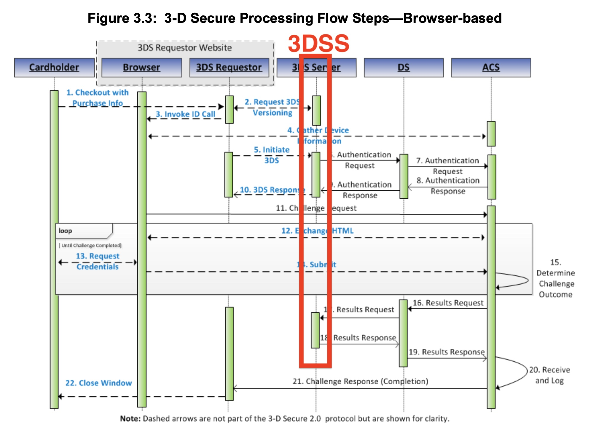

1. [ Описание ](#desc)
2. [ 3DS Versioning ](#version)
3. [ 3DS Method ](#method)
4. [ 3DS Authentication Flow ](#auth)
5. [ Result ](#result)

<a name="desc"></a>
# Описание

`3DSS` имплементирует требование по спецификации `EMVCo` к `3D Secure` взаимодействию, поддерживает только аутентификацию из вебсайта (`Browser-based`)



<a name="version"></a>
# 3DS Versioning

Перед прохождением `3DS Authentification Flow` `3DS Requestor` должен версионировать `PAN` плательщика. Результат версионирования подтверждает, что данный `PAN` является участником `3DS 2.0` и имеет право пройти аутентитфикацию `3DS Authentification Flow`, в протитвном случае результатом версионирования будет `HTTP 404 NOT FOUND`

Пример прохождения версионирования
```
-> Request [POST] http://three-ds-server:8080/versioning
Content-Type=application/json
{
  "accountNumber": "1234567890"
}

<- Response [POST] http://three-ds-server:8080/versioning
{
  "threeDsServerTransId": "bc9f0b90-1041-47f0-94df-d692170ea0d7",
  "dsProviderId": "visa",
  "acsStartProtocolVersion": "2.1.0",
  "acsEndProtocolVersion": "2.1.0",
  "dsStartProtocolVersion": "2.1.0",
  "dsEndProtocolVersion": "2.1.0",
  "threeDsMethodUrl": "url"
}
```
Пример ошибки версионирования
```
-> Request [POST] http://three-ds-server:8080/versioning
Content-Type=application/json
{
  "accountNumber": "9234567890"
}

<- Response [POST] http://three-ds-server:8080/versioning
HTTP 404 NOT FOUND
```

<a name="method"></a>
# 3DS Method

Дополнительный эндпоинт, который не обязателен для использования в `3DS Requestor`, используется для сборки HTML шаблона, который необходим при проведении `3DS Method` между `3DS Requestor` и [`ACS`]((https://github.com/rbkmoney/three-ds-server-compose/blob/master/docs/EMVCo_Protocol_and_Core_Functions_Specification_v2.2.0.pdf))

Пример
```
-> Request [POST] http://three-ds-server:8080/three-ds-method
Content-Type=application/json
{
  "threeDsMethodData": {
    "threeDSServerTransID": "1",
    "threeDSMethodNotificationURL": "url1"
  },
  "threeDsMethodUrl": "url2"
}

<- Response [POST] http://three-ds-server:8080/three-ds-method
{
  "htmlThreeDsMethodData": "...",
  "threeDsServerTransId": "1"
}
```
Где `htmlThreeDsMethodData`
 
```html
<!DOCTYPE html>
<html>
<body>

<h2>RBK.money 3D Secure Method Form</h2>

<form id="rbkMoneyThreeDsMethodForm" name="ThreeDsMethodForm"
      action="url2"
      method="POST">
    <input type="hidden"
           name="threeDSMethodData"
           value="eyJ0aHJlZURTU2VydmVyVHJhbnNJRCI6IjEiLCJ0aHJlZURTTWV0aG9kTm90aWZpY2F0aW9uVVJMIjoidXJsMSJ9"
    />
</form>

<script>
    document.getElementById("rbkMoneyThreeDsMethodForm").submit()
</script>
</body>
</html>
```

**Обратите внимание**, `3DSS` не проводит `3DS Method`, его проводит `3DS Requestor` напрямую с [`ACS`]((https://github.com/rbkmoney/three-ds-server-compose/blob/master/docs/EMVCo_Protocol_and_Core_Functions_Specification_v2.2.0.pdf))

Конечным результатом проведения `3DS Method` является определение параметра [`ThreeDsMethodCompletionInd`](https://github.com/rbkmoney/three-ds-server-domain-lib/blob/master/src/main/java/com/rbkmoney/threeds/server/domain/root/rbkmoney/RBKMoneyAuthenticationRequest.java#L46), который используется при проведении аутентификации `3DS Authentification Flow`. 

`3DS Method` можно провести без использования `3DSS`, самостоятельно собрав подобный шаблон `htmlThreeDsMethodData`, описанный здесь

<a name="auth"></a>
# 3DS Authentication Flow

Основной эндпоинт для взаимодействия с 3дс сервером, служит для прохождения аутентификации.

Описание актуальной модели в виде `java-файла` для выполнения `POST HTTP json-запроса` при прохождении `3DS Authentification Flow` здесь — [`RBKMoneyAuthenticationRequest.md`](https://github.com/rbkmoney/three-ds-server-compose/blob/master/RBKMoneyAuthenticationRequest.md)

Актуальная модель в виде `java-файла` при получении `POST HTTP json-ответа` от [`макросервиса 3DSS`](https://github.com/rbkmoney/three-ds-server-compose) тут [RBKMoneyAuthenticationResponse.java](https://raw.githubusercontent.com/rbkmoney/three-ds-server-domain-lib/master/src/main/java/com/rbkmoney/threeds/server/domain/root/rbkmoney/RBKMoneyAuthenticationResponse.java)

Пример успешного прохождения `3DS Authentification Flow`
```
-> Request [POST] http://three-ds-server:8080/sdk
Content-Type=application/json
{
  "messageType": "RBKMONEY_AUTHENTICATION_REQUEST",
  "messageVersion": "2.1.0",
  ...
}

<- Response [POST] http://three-ds-server:8080/sdk
{
  "messageType": "RBKMONEY_AUTHENTICATION_RESPONSE",
  "messageVersion": "2.1.0",
  "threeDSServerTransID": "5201a899-749a-4300-841b-24a870565b51",
  "transStatus": "Y",
  "dsReferenceNumber": "DSServerRef123456",
  "acsReferenceNumber": "ACSRefNum1234",
  "acsTransID": "77bbb905-1ac1-464d-9b5f-3f5bdc43ffe4",
  "dsTransID": "1d042cf8-a44c-4111-a057-723b95e403d2",
  "authenticationValue": "AAABBZEEBgAAAAAAAAQGAAAAAAA=",
  "acsOperatorID": "00000014",
  "eci": "05"
}
```

Пример неудачного прохождения `3DS Authentification Flow`
```
-> Request [POST] http://three-ds-server:8080/sdk
Content-Type=application/json
{
  "messageType": "RBKMONEY_AUTHENTICATION_REQUEST",
  "messageVersion": "2.1.0",
  ...
}

<- Response [POST] http://three-ds-server:8080/sdk
{
  "messageType": "Erro",
  "messageVersion": "2.1.0",
  "errorCode": "404",
  "errorComponent": "A",
  "errorDescription": "Permanent system failure",
  "errorDetail": "Database not available"
}
```
Актуальная модель в виде `java-файла` при получении `POST HTTP json-ответа` от [`макросервиса 3DSS`](https://github.com/rbkmoney/three-ds-server-compose) тут [Erro.java](https://raw.githubusercontent.com/rbkmoney/three-ds-server-domain-lib/master/src/main/java/com/rbkmoney/threeds/server/domain/root/emvco/Erro.java) 

<a name="result"></a>
# Result

Запрос позволяет `3DS Requestor` получить результат аутентификации `3D Secure` при прохождении `Challenge flow` для получения сгенерированного значения `authenticationValue` и `eci` после того, как `3DS Requestor` получил успешные `CRes` от `ACS`, в протитвном случае результатом аутентификации `3D Secure` будет `HTTP 404 NOT FOUND`

Пример успешного получения результата `3D Secure`
```
-> Request [POST] http://three-ds-server:8080/result
Content-Type=application/json
{
  "threeDSServerTransID": "5201a899-749a-4300-841b-24a870565b51
}

<- Response [POST] http://three-ds-server:8080/result
{
  "authenticationValue": "asd0=",
  "eci": "eci"
}
```
Пример неудачного результата
```
-> Request [POST] http://three-ds-server:8080/result
Content-Type=application/json
{
  "threeDSServerTransID": "5201a899-749a-4300-841b-24a870565b51
}

<- Response [POST] http://three-ds-server:8080/result
HTTP 404 NOT FOUND
```

