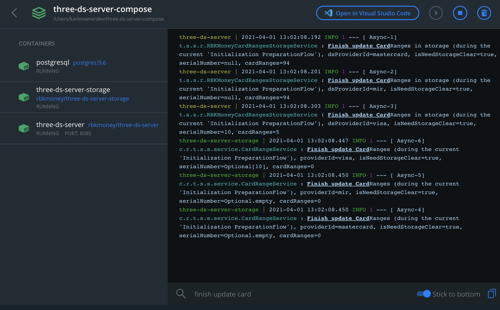

# three-ds-server-compose
Репозиторий с макросервисом [RBK.money 3D Secure Server](https://github.com/rbkmoney/three-ds-server) для запуска внутри [Docker](https://hub.docker.com/r/rbkmoney/three-ds-server)
## Сокращения
```
Directory Server = DS
3D Secure Server = 3DSS
```
## Использование
```bash
docker-compose up -d
```
  
Запуск [макросервиса](https://github.com/rbkmoney/three-ds-server/blob/master/pom.xml) полностью автоматизирован и производится внутри докера, образ скачивается напрямую из [репозитория `rbkmoney` на `Docker Hub`](https://hub.docker.com/r/rbkmoney/three-ds-server)  
**Обращаем внимание**, для корректного демо [RBK.money 3D Secure Server](https://github.com/rbkmoney/three-ds-server) порядок запуска:  
1. [`docker-compose.yml`](https://github.com/rbkmoney/three-ds-server-compose/blob/master/docker-compose.yml) [three-ds-server macroservice](https://github.com/rbkmoney/three-ds-server-compose#three-ds-server-compose) (сам макросервис 3DSS)
2. [`docker-compose.yml`](https://github.com/rbkmoney/three-ds-server-compose/blob/master/ds-simple-mock/docker-compose.yml) [ds-simple-mock](https://github.com/rbkmoney/three-ds-server-compose/tree/master/ds-simple-mock#ds-simple-mock) (пример сервиса, который может быть использован в качестве заглушки для обработки [`PReq` && `AReq` запросов](https://github.com/rbkmoney/three-ds-server-compose/blob/master/docs/EMVCo_Protocol_and_Core_Functions_Specification_v2.2.0.pdf) в DS от [`макросервиса 3DSS`](https://github.com/rbkmoney/three-ds-server-compose#three-ds-server-compose))
3. [`docker-compose.yml`](https://github.com/rbkmoney/three-ds-server-compose/blob/master/pseudo-schedulator/docker-compose.yml) [pseudo-schedulator](https://github.com/rbkmoney/three-ds-server-compose/tree/master/pseudo-schedulator#pseudo-schedulator) (пример сервиса, который может быть использован в качестве заглушки для инциализации [`PReq/PRes flow`](https://github.com/rbkmoney/three-ds-server-compose/blob/master/docs/EMVCo_Protocol_and_Core_Functions_Specification_v2.2.0.pdf) в [`макросервис 3DSS`](https://github.com/rbkmoney/three-ds-server-compose#three-ds-server-compose))

Если запуск будет произведен корректно, то по задумке автора в качестве финального результата в логах должны быть записи об успешной записи карточных диапазонов в хранилище  
  
## Описание
`Макросервис 3DSS` имплементирует требование по спецификации `EMVCo` к `3D Secure` взаимодействию, поддерживает только аутентификацию из вебсайта (`Browser-based`)  
Подробнее — [ЗДЕСЬ](https://github.com/rbkmoney/three-ds-server-compose/blob/master/3DSS%20detailed%20Description.md)  
## Конфигурация
`Макросервис 3DSS` является клиентом для `DS`, и использует `DS` при выполенении запросов, обозначенных спецификацей `EMVCo` (ссылка ниже), поэтому для корректной работы `3DSS` необходима настройка обоих доменов (сервисов)  
### Настройка домена совместимости (домен `DS`)
При запуске `макросервиса 3DSS` должен выполнить запрос на обновление карточных диапазонов `PReq/PRes flow`, поэтому перед запуском `макросервиса 3DSS` необходимо убедиться, что есть доступ к активному `DS`, который готов принимать HTTP запросы  
В этом репозитории находится [ds-simple-mock](https://github.com/rbkmoney/three-ds-server-compose/tree/master/ds-simple-mock#ds-simple-mock), который может быть использован в качестве заглушки для обработки [`PReq` && `AReq` запросов](https://github.com/rbkmoney/three-ds-server-compose/blob/master/docs/EMVCo_Protocol_and_Core_Functions_Specification_v2.2.0.pdf) в `DS` от [`макросервиса 3DSS`](https://github.com/rbkmoney/three-ds-server-compose#three-ds-server-compose))  
Подробнее — [ЗДЕСЬ](https://github.com/rbkmoney/three-ds-server-compose/tree/master/ds-simple-mock#ds-simple-mock)  
### Настройка планировщика расписания
При запуске `3DSS` **кто то** должен выполнить запрос на обновление карточных диапазонов `PReq/PRes flow`, поэтому перед запуском `макросервиса 3DSS` необходимо убедиться, что подобный сервис имплементирован и готов выполнять запросы по инициализации `PReq/PRes flow` в соотвествии с требованиями спецификации `EMVCo` (то есть минимальный интервал между запросами — 1 час, максимальный — 24 часа)  
Более детальное описание процесса — [ЗДЕСЬ](https://github.com/rbkmoney/three-ds-server-compose/blob/master/docs/EMVCo_Protocol_and_Core_Functions_Specification_v2.2.0.pdf) -> `5.6 PReq/PRes Message Handling Requirements (page 119)`  
В этом репозитории находится [pseudo-schedulator](https://github.com/rbkmoney/three-ds-server-compose/tree/master/pseudo-schedulator#pseudo-schedulator), который может быть использован в качестве заглушки для инциализации [`PReq/PRes flow`](https://github.com/rbkmoney/three-ds-server-compose/blob/master/docs/EMVCo_Protocol_and_Core_Functions_Specification_v2.2.0.pdf) в [`макросервис 3DSS`](https://github.com/rbkmoney/three-ds-server-compose#three-ds-server-compose)  
Подробнее — [ЗДЕСЬ](https://github.com/rbkmoney/three-ds-server-compose/tree/master/pseudo-schedulator#pseudo-schedulator)  
### Настройка домена эквайера (домен `3DSS`)
На данный момент сервис поддерживает обработку 3 провайдеров `{providerId}` — `visa`, `mastercard`, `mir`  
1) Указать в директории [cert](https://github.com/rbkmoney/three-ds-server-compose/tree/master/three-ds-server/cert) ключи `mir.p12`, `visa.p12`, `mastercard.p12`, которые используются `3DSS` для соединения с `DS` (для примера в директории нахадится [тестовый сертификат](https://github.com/rbkmoney/three-ds-server-compose/blob/master/three-ds-server/cert/test.p12))  

Ключи будут использоваться параметром:  
```yaml
client.ds.ssl.{providerId}.trust-store: file:/opt/three-ds-server/cert/test.p12
```
Указать пароли для ключей:  
```yaml
client.ds.ssl.{providerId}.trust-store-password: {{password}}
```
Изменить (при необходимости) volume  
```yaml
volumes:
  - ./three-ds-server/cert:/opt/three-ds-server/cert/:ro
```
2) Указать адрес `DS` для каждого `{providerId}`  
```yaml
environment.{providerId}.ds-url: http://ds:8081/{providerId}/DS2/authenticate
```
3) Настройка расписания для обновления карточных диапазонов [`3DS Preparation Flow`](https://github.com/rbkmoney/three-ds-server-compose/blob/master/docs/EMVCo_Protocol_and_Core_Functions_Specification_v2.2.0.pdf)  

В этом репозитории находится [pseudo-schedulator](https://github.com/rbkmoney/three-ds-server-compose/tree/master/pseudo-schedulator#pseudo-schedulator), который может быть использован в качестве заглушки для инциализации [`PReq/PRes flow`](https://github.com/rbkmoney/three-ds-server-compose/blob/master/docs/EMVCo_Protocol_and_Core_Functions_Specification_v2.2.0.pdf) в [`макросервис 3DSS`](https://github.com/rbkmoney/three-ds-server-compose#three-ds-server-compose)  
Подробнее — [ЗДЕСЬ](https://github.com/rbkmoney/three-ds-server-compose/tree/master/pseudo-schedulator#pseudo-schedulator)  
> **Лучше пишите собственную импементацию**  
> Cтандартная имплементация через [rbkmoney-schedulator](https://github.com/rbkmoney/schedulator) **выключена** (параметр `rbkmoney-preparation-flow.scheduler.enabled: "false"`) (данный сервис тянет за собой каскад других rbkmoney сервисов, поэтому это выходит за рамки данной демонстрации)  
## Тестирование `3DS Authentification Flow`
Для теста в `3DSS` посылаются 2 запроса, у одного `"acctNumber": "2201010000000000"`, у второго `"acctNumber": "4012000000001001"`  
В данном тесте в качестве сервиса `DS` используется собственный мок-сервис `ds-simple-mock`  
`3DSS` (с помощью мок-сервиса `DS`) настроен так, что `"acctNumber": "2201010000000000"` ассоциирует с `mastercard` , `"acctNumber": "4012000000001001"` ассоциирует с `visa`, и отправляет запрос в соотвествующий `DS` (`mir` также поддерживается для запросов)  

